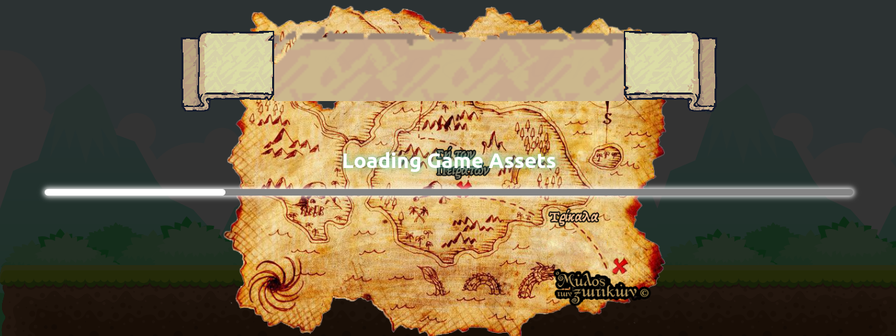
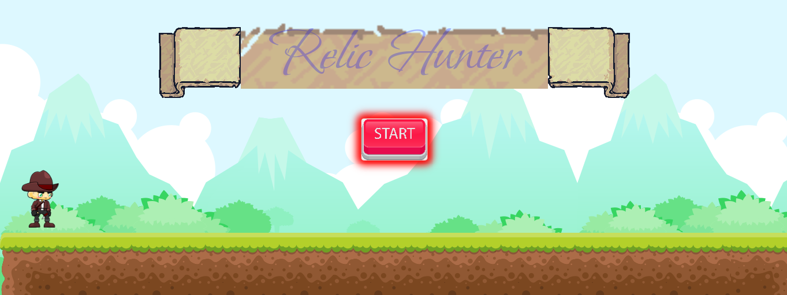
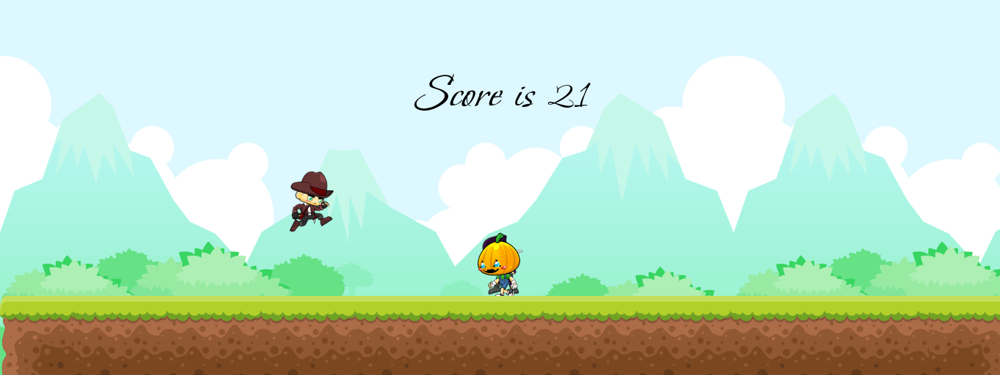
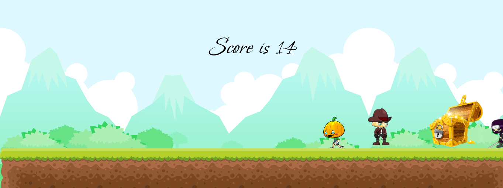
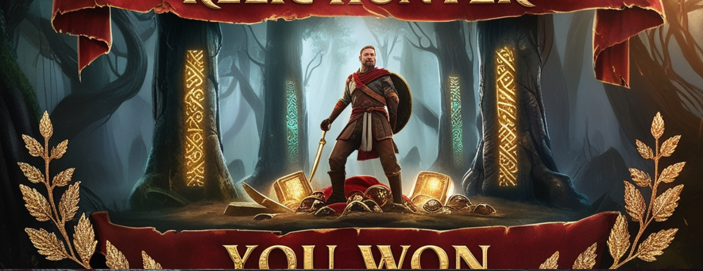

# 2D Relic Hunter Game
Welcome to the 2D Relic Hunter Game! This game is developed using HTML, CSS, and JavaScript. It features vibrant sprites, smooth animations, and an engaging gameplay experience.

## Table of Contents
About the Game
Features
Technologies Used
Installation
Usage
Contributing
License

### About the Game
In the 2D Relic Hunter Game, you take on the role of an adventurous relic hunter, exploring ancient ruins and overcoming various challenges to collect precious relics. The game is designed to provide a fun and immersive experience with beautiful graphics and smooth animations.

### Features
Engaging Gameplay: Navigate through, avoid obstacles, and collect relics.
Beautiful Graphics: High-quality game sprites downloaded from GameArt2D.
Animated Elements: Stunning animations implemented using animate.css.
Game Won/Lost Banners: AI-generated banners from Leonardo AI for a polished look.
Responsive Design: Optimized for various screen sizes and devices.

### Technologies Used
HTML: For the structure of the game.
CSS: For styling and layout.
JavaScript: For game logic and interactivity.
animate.css: For additional animations.
Vite: For building and bundling the project.
Firebase: For deployment and hosting.

### Installation

### To run the game locally, follow these steps:

#### Clone the repository:
git clone https://github.com/your-username/2d-relic-hunter.git

#### Navigate to the project directory:

#### Install the dependencies:
npm install

#### Run the development server:
npm run dev

#### Usage
To play the game, open your browser and navigate to the Firebase-hosted URL or run it locally using the development server.

### Contributing
Contributions are welcome! If you have suggestions for improvements or new features, please open an issue or create a pull request. Follow these steps to contribute:

Fork the repository.
Create a new branch:

git checkout -b feature-name
Make your changes and commit them:
git commit -m 'Add some feature'

Push to the branch:
git push origin feature-name

Open a pull request.
## Version
1.0.0

## License
This project is licensed under the MIT License. See the LICENSE file for more details.

Thank you for checking out the 2D Relic Hunter Game! Enjoy your adventure!

## Contact :
Yasith Perera
yasithishara@gmail.com
